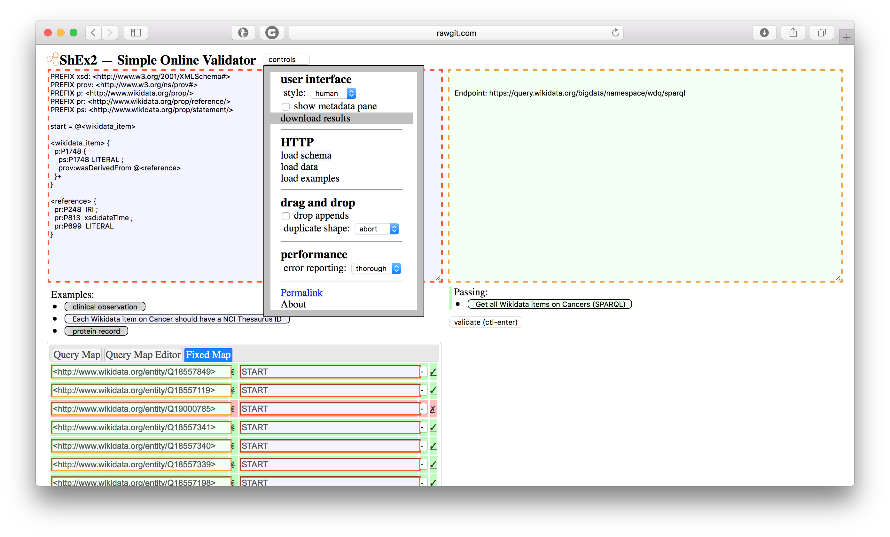
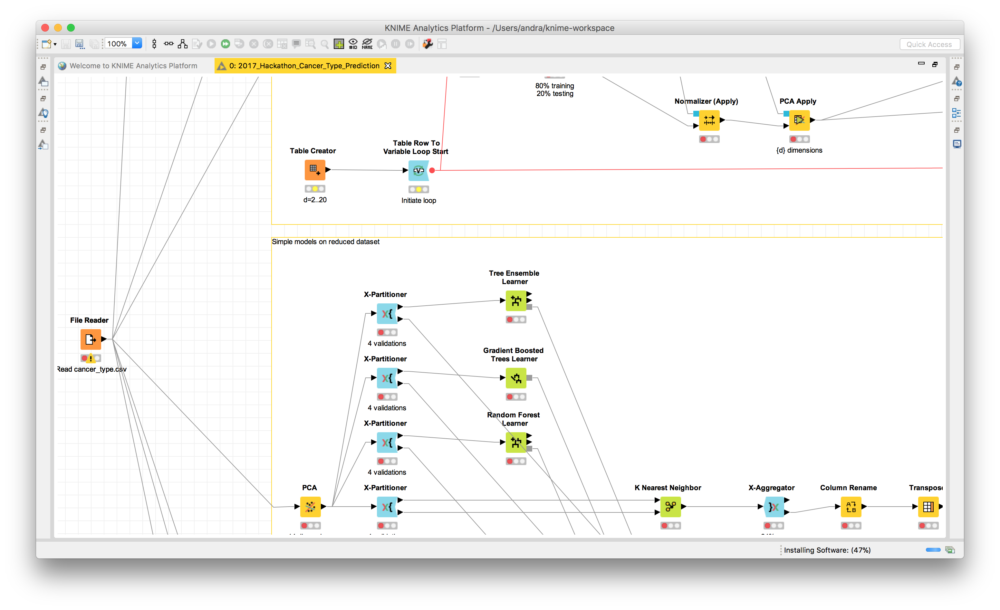
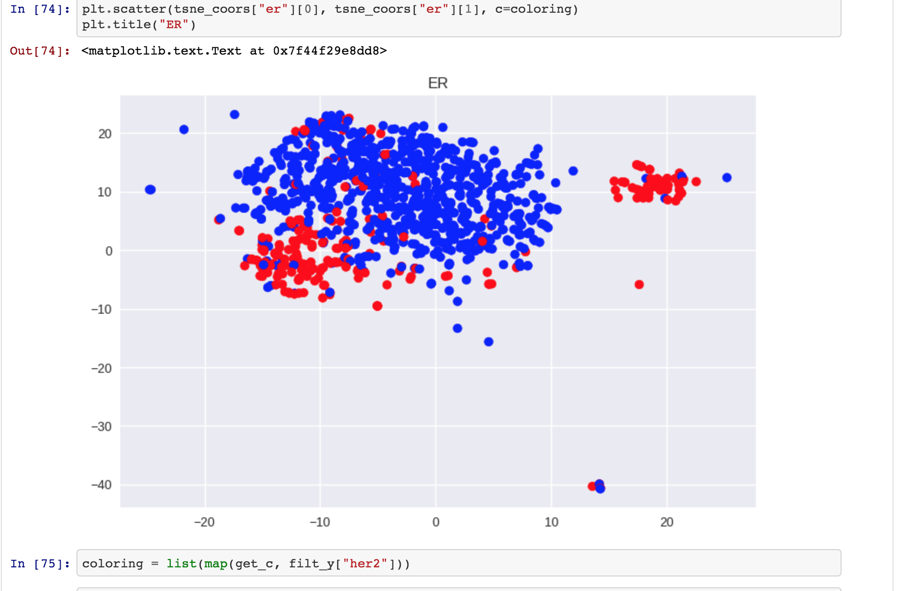

# SWAT4HCLS hackathon
The final day of the SWAT4HCLS in Rome, was for the hackathon. We had access to three rooms, of which one was for plenary sessions and two were for the actual hacking. 4 ideas  
## Bioschemas
During the hackathon Leyla Garcia wrote a Shape Expression to validate a [bioschema header](./ProteinEntity-with-context.shex). The ShEx file captured in this GitHub repo is a copy. The original lives in the [bioschemas repository](https://github.com/BioSchemas/specifications/tree/master/Protein).
 

## BYOD ShExathon
[ShEx Online Validator](http://rawgit.com/shexSpec/shex.js/wikidata/doc/shex-simple.html?#) is a ShEx validator build on top of the ShEx.js implementation. The pre-SWAT4HCLS implemantation lacked a feature to store the final results. During the hackathon a feature was added to the ShEx onoline validator, which allows downloading the ShEx results in json for downstream processing after a submitted ShEx was applied on a dataset tested for conformance. 

## Deep Neural Networks for Analysing Cancer Genomics Data
### Using Knime
Continuing on the SWAT4HCLS tutorial on deeplearning a group of participants continued during the hackathon in implementing the applied workflows as a [knime workflow](./2017_Hackathon_Cancer_Type_Prediction.knwf) 

### Predict breast cancer markers
Next to the Knime work, the participants also worked on  a [Jupyter Notebook](./Predict_breast_cancer_markers.ipynb) which predicts breast cancer markers.

## Wikidata
### Templates for federated queries using Wikidata as a source.
During the hackathon a group explored the possibilities of writing federated queries against the SPARQL endpoints of Wikidata, the RIKEN institute and the or the SPARQL endpoints of the [RIKEN institute](http://metadb.riken.jp/) and the [NDBC RDF Portal](https://integbio.jp/rdf/). This resulted in a set of [templates for federated queries sourcing Wikidata]( https://etherpad.wikimedia.org/p/wikidatafedqueries)

## Mapping HPO, LOINC and SNOMED
The hackathon also lead to discussions on mapping [LOINC](https://loinc.org/)  and the [Human Phenotype Ontology](http://human-phenotype-ontology.github.io/). SNOMED was recognised as a potential source for enrichment of the HPO-LOINC mapping. 

